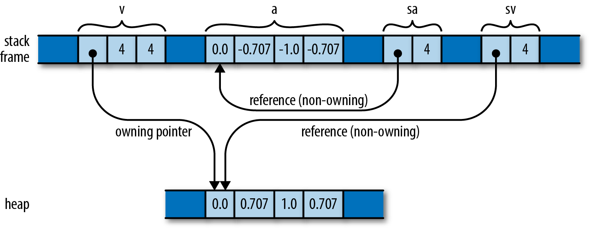

# Compound types in `Rust`

## Tuples

- Dissimilar types
- Cannot change number of members
- Reference elements using pattern matching

## Arrays, Vectors and Slices

- Arrays are fixed length allocations
- Vectors are dynamic

```rust
let v: Vec<f64> = vec![0.0,  0.707,  1.0,  0.707];
let a: [f64; 4] =     [0.0, -0.707, -1.0, -0.707];
let sv: &[f64] = &v;
let sa: &[f64] = &a;
```



## Structures

- Like classes or structures in other languages
- Tuple structs
- "C" like structs