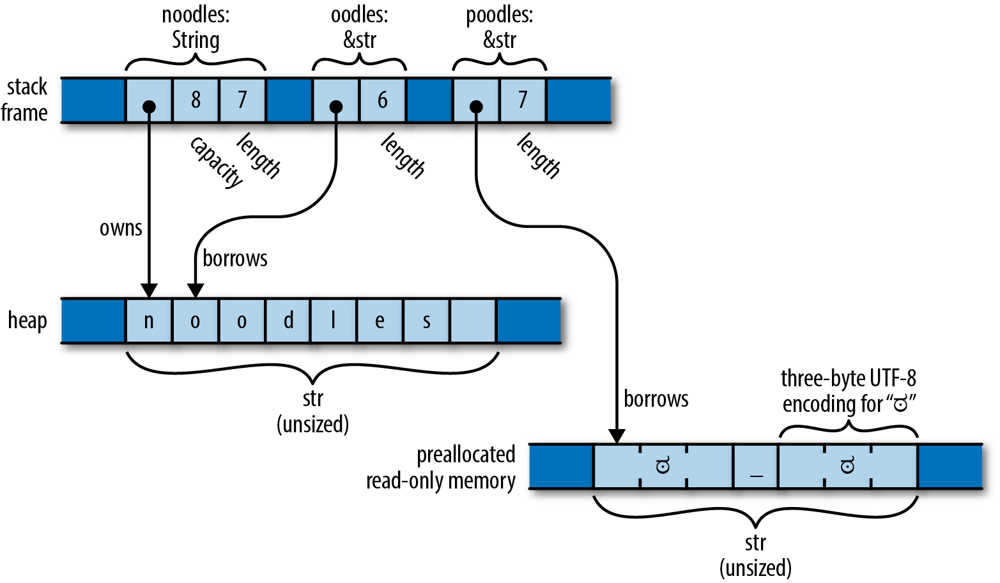

# Strings in `Rust`

## Characters

- Single unicode characters

## Byte strings

- Array of bytes

## Unicode strings

- By default returns a reference to a slice

## Strings and `str`

```rust
let noodles = "noodles".to_string();
let oodles = &noodles[1..];
let poodles = "ಠ_ಠ";
```


